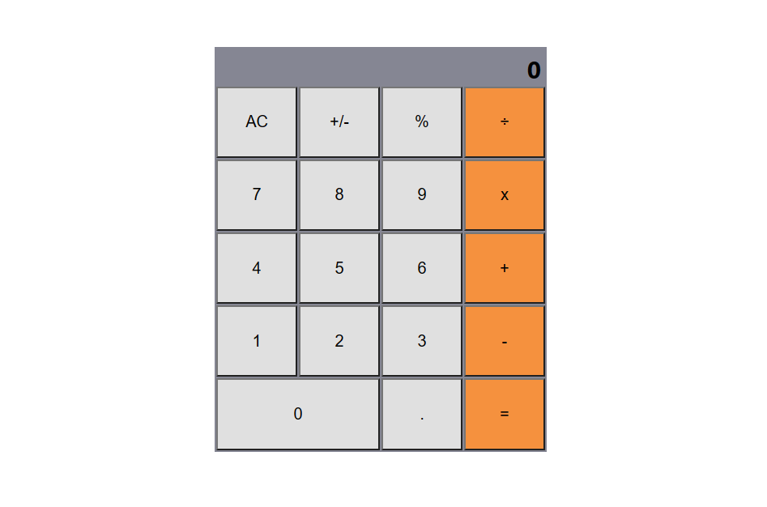

# Math Magicians

> A calculator application using React framework.

## Built With

- Html
- Css
- JavaScript
- React

## Live Demo

[Live Demo Link](https://keroloussamy.github.io/math-magicians/)

[Live Demo On Heroku](https://math-magicians-ks.herokuapp.com/math-magicians/)

[Live Demo On Netlify](https://math-madicians.netlify.app/)

## Getting Started
To get a local copy up and running follow these simple example steps.

- Click on the top right green "code" button.
- On the dropdown menu, choose "download with zip" button.
- After download, extract the zip file and you have the project on your machine.
- After downloading run `npm i` to install all Node packages.
- Run `npm start` to run the project.

## Author

👤 **Kerolous Samy**

- GitHub: [@kerolous](https://github.com/keroloussamy)
- Twitter: [@kerolous](https://twitter.com/SamyKerolous)
- LinkedIn: [kerolous](https://www.linkedin.com/in/keroloussamy/)

## 🤝 Contributing

Contributions, issues, and feature requests are welcome!

Feel free to check the [issues page](../../issues/).

## Show your support

Give a ⭐️ if you like this project!

## 📝 License

This project is [MIT](./MIT.md) licensed.
